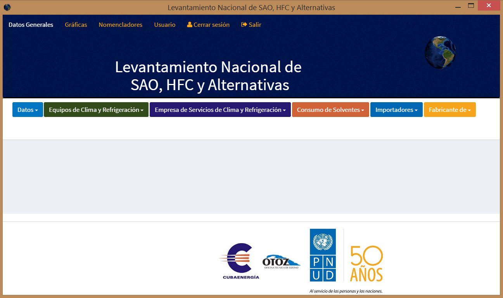

# Hello Electron with Pouchdb

This is a demo app that integrates PouchDB with Electron.

It shows how to use any of the following PouchDB adapters:

  * IndexedDB (browser-style)
  * WebSQL (browser-style)
  * LevelDB (Node-style)

The app looks like this:

## Install and run

Check out the code:

    git clone https://github.com/nolanlawson/hello-electron-with-pouchdb
    cd hello-electron-with-pouchdb

Then npm install:

    npm install

And run:

    npm start

If it doesn't work, you might not have the latest version of Node/npm. Try installing the latest using [nvm](https://github.com/creationix/nvm).

## Browser vs Node

In order to get LevelDB to work properly, this app uses a `postinstall` script that rebuilds the LevelDB C++ dependencies for Electron.

If this step doesn't work for you (e.g. because you are using an older version of Node, you're using Windows, etc.), you can remove the `postinstall` script from `package.json` and just use the browser adapters (IndexedDB/WebSQL) rather than the Node.js adapter (LevelDB).

See [pouchdb-electron](https://github.com/nolanlawson/pouchdb-electron) for more installation instructions.

## node-websql (sqlite3) adpater

This is currently not working. There's an open issue: https://github.com/nolanlawson/hello-electron-with-pouchdb/issues/3
